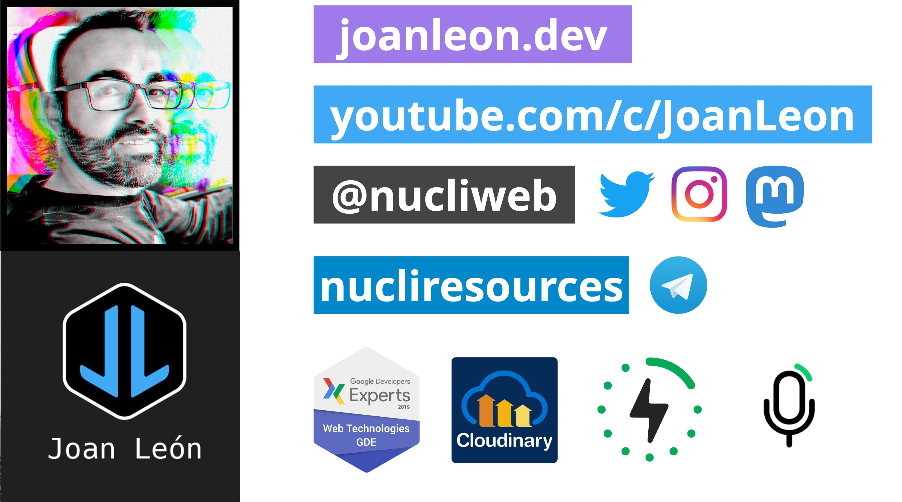

# Image Optimization Workshop

## Releases links

| Web                                                                                                                      | Repo                                                                                                                            |
| ------------------------------------------------------------------------------------------------------------------------ | ------------------------------------------------------------------------------------------------------------------------------- |
| [main](https://main--image-optimization-workshop.netlify.app/)                                                           | [main](https://github.com/nucliweb/image-optimization-workshop/)                                                                |
| [image-optim](https://image-optim--image-optimization-workshop.netlify.app/)                                             | [image-optim](https://github.com/nucliweb/image-optimization-workshop/tree/image-optim)                                         |
| [image-optim-webp](https://image-optim-webp--image-optimization-workshop.netlify.app/)                                   | [image-optim-webp](https://github.com/nucliweb/image-optimization-workshop/tree/image-optim-webp)                               |
| [image-optim-next-gen](https://image-optim-next-gen--image-optimization-workshop.netlify.app/)                           | [image-optim-next-gen](https://github.com/nucliweb/image-optimization-workshop/tree/image-optim-next-gen)                       |
| [image-optim-loading-lazy](https://image-optim-loading-lazy--image-optimization-workshop.netlify.app/)                   | [image-optim-loading-lazy](https://github.com/nucliweb/image-optimization-workshop/tree/image-optim-loading-lazy)               |
| [image-optim-css-images](https://image-optim-css-images--image-optimization-workshop.netlify.app/)                       | [image-optim-css-images](https://github.com/nucliweb/image-optimization-workshop/tree/image-optim-css-images)                   |
| [image-optim-responsive-images](https://image-optim-responsive-images--image-optimization-workshop.netlify.app/)         | [image-optim-responsive-images](https://github.com/nucliweb/image-optimization-workshop/tree/image-optim-css-responsive-images) |
| [image-optim-css-responsive-images](https://image-optim-css-responsive-images--image-optimization-workshop.netlify.app/) | [image-optim-css-responsive-images](https://github.com/nucliweb/image-optimization-workshop/tree/image-optim-responsive-images) |
| [image-optim-cloudinary](https://image-optim-cloudinary--image-optimization-workshop.netlify.app/)                       | [image-optim-cloudinary](https://github.com/nucliweb/image-optimization-workshop/tree/image-optim-cloudinary)                   |
| [image-optim-video](https://image-optim-video--image-optimization-workshop.netlify.app/)                                 | [image-optim-video](https://github.com/nucliweb/image-optimization-workshop/tree/image-optim-video)                             |
| [image-optim-video-cloudinary](https://image-optim-video-cloudinary--image-optimization-workshop.netlify.app/)           | [image-optim-video-cloudinary](https://github.com/nucliweb/image-optimization-workshop/tree/image-optim-video-cloudinary)       |

## Resources

- [Best practices for images](https://github.com/nucliweb/image-element)
- [Optimización de imágenes y vídeo para la web](https://slides.com/joanleon/optimizacion-de-imagenes-y-video-para-la-web-57bbad)
- [Learn Images](https://web.dev/learn/images/)
- [Largest Contenful Paint](https://web.dev/lcp/)
- [¿Por dónde empiezo para optimizar mis imágenes?](https://joanleon.dev/por-donde-empiezo-para-optimizar-mis-imagenes)
- [El formato vídeo en la web](https://perf.reviews/blog/video-en-la-web/)
- [📘 Image Optimization](https://www.smashingmagazine.com/printed-books/image-optimization/)
